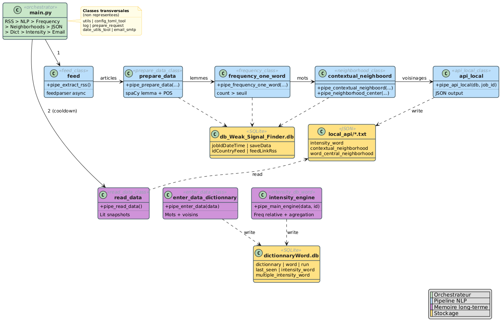

# 🔍 Weak Signal Finder

Weak Signal Finder is a Python pipeline that **detects emerging themes and weak signals** from RSS news feeds. It aggregates articles by language/country, cleans and lemmatizes the text using NLP, computes word frequency scores, builds contextual semantic neighborhoods, persists every run in a local SQLite database, and exposes the final results as a dated JSON file.

It also maintains a **persistent neighborhood dictionary** in a second SQLite database, which is enriched automatically across runs and lets you observe how each word's semantic neighborhood evolves over time. An optional **SMTP email notification** can be sent at the end of every run.

---

## 📐 Architecture

```
                rssFeed.json
                     │
                     ▼
              feed_class                ← RSS aggregation (feedparser)
                     │
                     ▼
              prepare_data_class        ← Cleaning, lemmatization, stopword removal (spaCy)
                     │
                     ▼
   frequency_one_word_class             ← Word intensity / frequency scoring
   contextual_neighborhood_class        ← Semantic neighborhood computation
                     │
                     ▼
              api_local_class           ← Output as a dated local JSON file
                     │
                     ▼
   read_data_class  +  enter_data_dictionnary_class
                                        ← Cross-run aggregation into the
                                          persistent neighborhood dictionary
                                          (triggered on a configurable cooldown)
                     │
                     ▼
              email_smtp_class          ← Optional end-of-run SMTP notification

   ─────────────────────────────────────────────────
   Two SQLite databases, tagged with a per-run job_id:
     • db_Weak_Signal_Finder.db   → jobIdDateTime, saveData,
                                    idCountryFeed, feedLinkRss
     • dictionnaryWord.db         → dictionnary, word, run, know_folder
   ─────────────────────────────────────────────────
```



---

## 🖥️ System Requirements

| Requirement | Minimum | Recommended |
|---|---|---|
| Python | 3.9 | 3.11+ |
| RAM | 2 GB | 4 GB+ |
| OS | Windows / Linux / macOS | Linux / macOS |

> spaCy `_md` language models can be memory-intensive, especially when processing large volumes of articles simultaneously. 4 GB+ of RAM is recommended if you monitor more than 10 feeds.

---

## ⚙️ Installation

### 1. Clone the repository

```bash
git clone https://github.com/your-username/weak-signal-finder.git
cd weak-signal-finder
```

### 2. Install the dependencies

`requirements.txt` already pulls spaCy **and** the medium models for English, French, German, Spanish, and Russian:

```bash
pip install -r requirements.txt
```

*(Optional)* Download an additional spaCy model if you want to support a language beyond the five preinstalled. The mapping is defined in `libCore/input/languageModel.json`. Example:

```bash
python -m spacy download it_core_news_md
```

### 3. Create the two SQLite databases

> ⚠️ **The repository does not ship with prebuilt `.db` files anymore.** You must create both databases yourself and apply the schemas before the first run. This step is **mandatory**, the pipeline will not start without these two files in place.

The project uses **two** independent SQLite databases:

| Database file | Role | Schema |
|---|---|---|
| `database_rss_run/database_don_t_touch/db_Weak_Signal_Finder.db` | Per-run pipeline state (job IDs, raw snapshots, intensity scores, neighborhoods, feed metadata). | `database_rss_run/request/schema_db.sql` |
| `dictionnary_neighbord/database/dictionnaryWord.db` | Persistent cross-run neighborhood dictionary (the long-term memory of the tool). | `dictionnary_neighbord/database/schema_table.sql` |

Create them both and load the schemas. Examples below assume you run the commands from the project root.

**On Linux / macOS:**

```bash
# Main run database
sqlite3 database_rss_run/database_don_t_touch/db_Weak_Signal_Finder.db < database_rss_run/request/schema_db.sql

# Dictionary database
sqlite3 dictionnary_neighbord/database/dictionnaryWord.db < dictionnary_neighbord/database/schema_table.sql
```

**On Windows (PowerShell):**

```powershell
# Main run database
Get-Content database_rss_run\request\schema_db.sql | sqlite3 database_rss_run\database_don_t_touch\db_Weak_Signal_Finder.db

# Dictionary database
Get-Content dictionnary_neighbord\database\schema_table.sql | sqlite3 dictionnary_neighbord\database\dictionnaryWord.db
```

**Alternative, pure Python (works everywhere, no `sqlite3` CLI required):**

```bash
python -c "import sqlite3; sqlite3.connect('database_rss_run/database_don_t_touch/db_Weak_Signal_Finder.db').executescript(open('database_rss_run/request/schema_db.sql').read())"
python -c "import sqlite3; sqlite3.connect('dictionnary_neighbord/database/dictionnaryWord.db').executescript(open('dictionnary_neighbord/database/schema_table.sql').read())"
```

After this step you should have:

```
database_rss_run/database_don_t_touch/db_Weak_Signal_Finder.db
dictionnary_neighbord/database/dictionnaryWord.db
```

The dictionary schema seeds a single row in the `run` table (`jobId="0"`, `date_="1970-01-01"`) so the very first execution of the pipeline considers the cooldown elapsed and triggers a dictionary update. This is intentional.

> 💡 If you ever want to wipe the data and start fresh without recreating the files, run the `erase_all_table.sql` (run DB) and `erase_table.sql` (dictionary DB) scripts the same way.

### 4. (Optional) Set up email notifications

If you want to receive an email at the end of every run, see the [📧 Email Notifications (SMTP)](#-email-notifications-smtp) section below. This step is **optional** — set `authorize_run = false` in the TOML and skip this entirely if you don't need it.

---

## 🚀 Usage

Once the databases are in place, simply run the main script:

```bash
python main.py
```

> **Run from the project root.** The pipeline is designed to be launched with the project root as the working directory, either from an IDE configured that way, or from a terminal opened directly in the project folder (e.g. `cd weak-signal-finder` then `python main.py`). This is a deliberate design choice: paths declared in `config_weakSignalFinder.toml` and elsewhere are resolved relative to the current working directory, so executing `python /some/other/path/main.py` from a different location will not find the input files or the databases.

Each run:
1. Generates a unique `job_id` and registers it in the run database.
2. Reads the RSS feed list from `libCore/input/rssFeed.json`.
3. Fetches and parses all articles asynchronously.
4. Cleans and lemmatizes the text.
5. Computes word frequency scores and semantic neighborhoods.
6. Persists every intermediate state in the run database (tagged with the `job_id`).
7. Writes the final result to `local_api/YYYY_M_D.local_api.txt`.
8. **Checks the dictionary cooldown.** If enough days have elapsed since the last dictionary update (see `cooldown_day_launch_dictionnary`), the pipeline automatically reads the `local_api/` outputs and enriches the persistent neighborhood dictionary.
9. **Sends a notification email** if `authorize_run = true` is set in `[parameter .email_auto]`.

### Output format

The output is a newline-delimited JSON file. Each line is a full dated snapshot:

```json
{
  "time": "[2024-01-15 08:30:00]",
  "time_jobid": "[202411300123456]",
  "intensity_word": {
    "climate": 42,
    "energy": 31,
    "transition": 18
  },
  "contextual_neighborhood": {
    "before":   [["energy", "climate"], ["new", "policy"]],
    "beetween": [["green", "energy", "policy"], ["rapid", "climate", "shift"]],
    "after":    [["climate", "change"], ["policy", "reform"]]
  },
  "word_central_neighborhood": {
    "climate": { "before": ["energy", "new"], "after": ["change", "policy"] },
    "energy":  { "before": ["green", "cheap"], "after": ["transition", "crisis"] }
  }
}
```

**Field reference:**

| Field | Type | Description |
|---|---|---|
| `time` | string | Human-readable timestamp of the run |
| `time_jobid` | string | Unique job identifier for the run |
| `intensity_word` | object | Words appearing more than once, with their frequency score |
| `contextual_neighborhood` | object | All word pairs/triplets found in `before`, `beetween`, `after` positions |
| `word_central_neighborhood` | object | For each word: its unique direct neighbors (left and right) |

---

## 📚 Persistent Neighborhood Dictionary

The `dictionnary_neighbord/` module is the **long-term memory** of the tool. While each run produces a snapshot of the current semantic landscape in `local_api/`, the dictionary database accumulates these snapshots over time so you can study how the neighborhood of any given word evolves.

### How it works

At the end of every run, `main.py` calls `enter_data_dictionnary.for_launch()`. This compares today's date with the most recent entry in the `run` table of `dictionnaryWord.db`:

- If the difference (in days) is **greater than or equal to** `cooldown_day_launch_dictionnary` (set in `config_weakSignalFinder.toml`), a dictionary update is triggered.
- Otherwise the dictionary is left untouched for this run.

When an update is triggered:
1. `read_data_class` scans `local_api/` for every dated output file, **except** those listed in `dictionnary_neighbord/exclude_file.txt` and those already recorded in the `know_folder` table.
2. It picks the JSON field configured by `part_of_local_api` (default: `word_central_neighborhood`) from every snapshot and merges all blocks into a single deduplicated structure (one `before` set and one `after` set per central word).
3. `enter_data_dictionnary_class` opens `dictionnaryWord.db`:
   - It inserts every new central word into the `word` table, tagged with the current `job_id`.
   - It inserts every new `(central_word, position, neighbor)` triplet into the `dictionnary` table (`position` is `before` or `after`), also tagged with the `job_id`. Triplets already present are skipped, so the table grows without duplicates.
   - It records the consumed file names in the `know_folder` table to avoid re-reading them on the next dictionary update.
   - It records the current `job_id` and date in the `run` table so the cooldown can be enforced next time.

### Database schema

`dictionnaryWord.db` contains four tables:

```sql
CREATE TABLE IF NOT EXISTS dictionnary(
   central_word TEXT,
   position_     TEXT,        -- "before" or "after"
   word_neighbor TEXT,
   run_added     TEXT         -- job_id that inserted this triplet
);

CREATE TABLE IF NOT EXISTS word(
   word      TEXT,
   run_added TEXT,
   PRIMARY KEY(word),
   FOREIGN KEY(word) REFERENCES dictionnary(central_word)
);

CREATE TABLE IF NOT EXISTS run(
   jobId TEXT,
   date_ TEXT,
   PRIMARY KEY(jobId)
);

CREATE TABLE IF NOT EXISTS know_folder(
   jobId       TEXT,
   name_folder TEXT,
   PRIMARY KEY(name_folder)
);
```

### Excluding output files

`dictionnary_neighbord/exclude_file.txt` lists, one per line, the file names from `local_api/` that the dictionary loader must ignore (the default ships with `test` and `placeholder`). Add a file name here if you want to keep it in `local_api/` for inspection but not feed it into the dictionary.

### Tuning the cooldown

The cooldown is set under `[parameter .for_launch]` in the TOML:

```toml
[parameter .for_launch]
cooldown_day_launch_dictionnary = 1
```

- `1` (default) means the dictionary is refreshed on every calendar day on which the pipeline runs.
- Set it to `7` for a weekly aggregation, `30` for monthly, etc.
- Set it to `0` if you want the dictionary to be enriched on **every** run (no cooldown).

### Choosing the source field

The same section also controls which block of the `local_api/*.local_api.txt` snapshots is consumed by the dictionary loader:

```toml
[parameter .for_launch]
part_of_local_api = "word_central_neighborhood"
```

- `word_central_neighborhood` (default) is the recommended value, it gives one structured `{before, after}` block per central word.
- Any other top-level field present in the snapshot JSON can technically be used, but the loader expects a `{ word: { before: [...], after: [...] } }` shape, so changing this value without changing the loader logic will most likely break the dictionary update.

---

## 📧 Email Notifications (SMTP)

The pipeline can send a **notification email at the end of every run** (after the dictionary update step). It is optional, disabled by flipping a single boolean, and built on the Python standard library (`smtplib`) plus `python-dotenv` for the password.

### What it sends

When enabled, the end-of-run email contains:
- The run's timestamp,
- The `job_id`,
- A link to the project repository,
- A short copyright line.

The topic and message are emitted by `libCore/email_smtp_class.py` after every successful run. If the email cannot be prepared or cannot be sent, the pipeline does **not** fail, it just logs an `ERROR` line and finishes normally.

### How it works

The flow is intentionally minimal:

1. The TOML section `[parameter .email_auto]` is read.
2. The password is loaded from a separate file (defaults to `password_app.env` at the project root) via `dotenv.load_dotenv()`. Only the variable `PASSWORD_EMAIL` is read.
3. An SMTP connection is opened to `server:port`, upgraded with `STARTTLS`, and authenticated with `sender` + `PASSWORD_EMAIL`.
4. The email is sent to `receiver`.

The defaults are configured for **Gmail** (`smtp.gmail.com` on port `587`), but any SMTP server that speaks STARTTLS on a submission port works.

### Configuration

The TOML block lives at the bottom of `config_weakSignalFinder.toml`:

```toml
[parameter .email_auto]
authorize_run = true
server        = "smtp.gmail.com"
port          = 587
sender        = "[EMAIL_ADDRESS]"
password_file = "password_app.env"
receiver      = "[EMAIL_ADDRESS]"
```

| Key | Role |
|---|---|
| `authorize_run` | `true` enables the end-of-run email, `false` disables it entirely. |
| `server` | SMTP server hostname. Gmail = `smtp.gmail.com`. |
| `port` | SMTP submission port. Use `587` (STARTTLS). The current implementation does **not** support implicit TLS on `465`. |
| `sender` | The email address used to authenticate and to send from. |
| `password_file` | Path (relative to the project root) of the `.env` file containing the credential. |
| `receiver` | The email address that receives the notification. Can be the same as `sender`. |

### Setup (Gmail example)

1. **Enable 2-Step Verification** on your Google account. App Passwords require it.
2. **Generate a Google App Password** at <https://myaccount.google.com/apppasswords> — pick "Mail" and any device name. You'll get a 16-character code. This is your `PASSWORD_EMAIL`, **not your normal Google password**.
3. **Create the password file** at the project root by copying the shipped template:
   ```bash
   cp archive_configuration/password_app.env.archive password_app.env
   ```
4. **Edit `password_app.env`** and replace the placeholder with the App Password you just generated:
   ```env
   PASSWORD_EMAIL=abcd efgh ijkl mnop
   ```
   (Gmail App Passwords are shown with spaces, you can paste them with or without — both work.)
5. **Fill `sender` and `receiver`** in `config_weakSignalFinder.toml` with your real email addresses.
6. **Leave `authorize_run = true`** — or set it to `false` later if you want to mute notifications temporarily without removing the credentials.

For other providers (Outlook, ProtonMail Bridge, custom SMTP, etc.), only `server`, `port`, `sender`, and the value of `PASSWORD_EMAIL` need to be adjusted. The server must accept STARTTLS on the chosen port.

### 🔒 Security notes

A small, standard checklist for handling SMTP credentials, please apply it even if the project is private:

- **Never commit `password_app.env`.** The shipped `.gitignore` already excludes `*.env` and `.env`, keep it that way.
- **Use an App Password, not your account password.** For Gmail, accounts with 2-Step Verification cannot use the main password over SMTP anyway, so App Passwords are mandatory. Even for providers that allow the main password, prefer a dedicated App/SMTP password you can revoke independently.
- **The TOML is committed, the password is not.** `sender`, `receiver`, `server`, and `port` live in the TOML and will end up in version control if you push the config. If those addresses are personal, either keep the repo private or replace them with placeholders before publishing.
- **Revoke and rotate.** If the password file is ever leaked, **revoke the App Password from your provider** (Gmail: same App Passwords page) and generate a new one. Do not just edit `password_app.env`.
- **Disable when you don't need it.** Set `authorize_run = false` to fully short-circuit the SMTP step, no connection is opened, no credential is loaded.

---

## 🛠️ Configuration

All runtime configuration lives in a single TOML file at the project root, with the input files used by the NLP pipeline. Edit them to fit your monitoring scope.

### Main configuration, `config_weakSignalFinder.toml`

`config_weakSignalFinder.toml` is the **central configuration file**. It declares every path the pipeline uses (inputs, outputs, both databases, log/dataset/savestate folders) and exposes the tunable parameters of the analysis. It is loaded once at startup by `libCore/config_tool_class.py` and consumed by every module via `key_return(table, key, sub_table)`.

```toml
[path]

[path .class_feed]
extract_feed_Path = "libCore\\input\\rssFeed.json"

[path .api_local]
open_file = "local_api\\"

[path .log]
save_data_set = "dataset\\"
save_state    = "saveState\\"
log_file      = "log\\"

[path .prepare_data]
file_model    = "libCore\\input\\languageModel.json"
file_stopword = "libCore\\input\\stopword.txt"

[path .read_data_dictionnary]
exclude_file = "dictionnary_neighbord\\exclude_file.txt"
dataset      = "local_api\\"

[path .database]
database_run_sqlite         = "database_rss_run\\database_don_t_touch\\db_Weak_Signal_Finder.db"
database_dictionnary_sqlite = "dictionnary_neighbord\\database\\dictionnaryWord.db"


[parameter]

[parameter .frequency_one_word]
filter_word = 1

[parameter .for_launch]
cooldown_day_launch_dictionnary = 1
part_of_local_api               = "word_central_neighborhood"

[parameter .email_auto]
authorize_run = true
server        = "smtp.gmail.com"
port          = 587
sender        = "[EMAIL_ADDRESS]"
password_file = "password_app.env"
receiver      = "[EMAIL_ADDRESS]"
```

**Section reference:**

| Section | Key | Role |
|---|---|---|
| `[path .class_feed]` | `extract_feed_Path` | Path to the JSON list of RSS feeds. |
| `[path .api_local]` | `open_file` | Folder where the dated `*.local_api.txt` output is written. |
| `[path .log]` | `log_file` / `save_state` / `save_data_set` | Folders for the execution log, the legacy savestate file, and the legacy dataset file. |
| `[path .prepare_data]` | `file_model` / `file_stopword` | Path to the spaCy language-model mapping and to the stopword list. |
| `[path .read_data_dictionnary]` | `exclude_file` / `dataset` | List of `local_api/` files to ignore when feeding the dictionary, and the folder it reads from. |
| `[path .database]` | `database_run_sqlite` | Path to the per-run pipeline SQLite database. |
| `[path .database]` | `database_dictionnary_sqlite` | Path to the persistent neighborhood dictionary SQLite database. |
| `[parameter .frequency_one_word]` | `filter_word` | Minimum frequency floor, words with a count `<=` this value are dropped from the final output. Default: `1`. |
| `[parameter .for_launch]` | `cooldown_day_launch_dictionnary` | Minimum number of days between two dictionary updates. Default: `1`. |
| `[parameter .for_launch]` | `part_of_local_api` | Top-level field of the `local_api/*.local_api.txt` snapshots that the dictionary loader consumes. Default: `word_central_neighborhood`. |
| `[parameter .email_auto]` | `authorize_run` | `true` to enable the end-of-run SMTP notification, `false` to disable. |
| `[parameter .email_auto]` | `server` / `port` | SMTP server and STARTTLS submission port. |
| `[parameter .email_auto]` | `sender` / `receiver` | The "from" and "to" addresses of the notification email. |
| `[parameter .email_auto]` | `password_file` | Path to the `.env` file holding `PASSWORD_EMAIL`. |

> Paths use Windows-style backslashes (`\\`) but are normalized internally, so the file works the same on Windows, Linux, and macOS.

A pristine copy of the configuration is shipped as **`archive_configuration/config_weakSignalFinder.toml.archive`**. If you ever break the active TOML during edits, you can restore the defaults by copying this archive back to `config_weakSignalFinder.toml` at the project root. A pristine `.env` template is also shipped as **`archive_configuration/password_app.env.archive`**.

### RSS Feeds, `libCore/input/rssFeed.json`

Define the feeds to monitor. Each entry has a source name, a feed URL, and a country/language code:

```json
[
  {
    "name_organization": "Le Monde",
    "rss_link": "https://www.lemonde.fr/rss/une.xml",
    "country": "fr"
  },
  {
    "name_organization": "BBC News",
    "rss_link": "https://feeds.bbci.co.uk/news/rss.xml",
    "country": "en"
  }
]
```

### Language Models, `libCore/input/languageModel.json`

Maps language codes to their spaCy model names. The `language` field is informational, `code_language` is the key actually used to dispatch articles:

```json
[
  { "language": "French",  "code_language": "fr", "model_name": "fr_core_news_md" },
  { "language": "English", "code_language": "en", "model_name": "en_core_web_md" }
]
```

### Stopwords, `libCore/input/stopword.txt`

One word per line. The shipped file is **pre-populated** with a large default set: English/French structural words plus a thematic block tied to politics, media, and institutions (e.g. `parliament`, `commission`, `bbc`, `nytimes`, `monday`, `region`, `million`...). Edit it freely to fit your monitoring scope, anything listed here is excluded from analysis on top of the spaCy POS filter (only nouns, proper nouns, verbs, and adjectives are kept).

### Dictionary exclusions, `dictionnary_neighbord/exclude_file.txt`

One file name per line. Any file in `local_api/` whose name appears here is skipped when the dictionary is being enriched. Defaults: `test`, `placeholder`.

---

## 📋 Run Outputs

Every run writes to several places, all tagged with the same `job_id`:

| Storage | Location | Role |
|---|---|---|
| **Run SQLite DB** | `database_rss_run/database_don_t_touch/db_Weak_Signal_Finder.db` | **Primary store for one run.** Contains `jobIdDateTime` (one row per run), `saveData` (raw and cleaned snapshots, intensity scores, neighborhoods), and the feed metadata tables (`idCountryFeed`, `feedLinkRss`). |
| **Dictionary SQLite DB** | `dictionnary_neighbord/database/dictionnaryWord.db` | **Cross-run memory.** Contains `dictionnary` (every `(central_word, position, neighbor)` triplet ever observed), `word` (the set of known central words), `run` (history of dictionary updates), and `know_folder` (snapshots already consumed). |
| `YYYY_M_D.local_api.txt` | `local_api/` | Final consumable JSON output, also consumed as input by the dictionary loader. |
| `YYYY_M_D.log.txt` | `log/` | Execution trace with severity levels (`INFO`, `WARN`, `ERROR`, `CRITICAL`) and the calling function. |
| `YYYY_M_D.savestate.txt` | `saveState/` | *Legacy file output*, kept for backward compatibility (see `LEGACY_FUNCTION.md`). The run database is now the source of truth. |
| `YYYY_M_D.dataset.txt` | `dataset/` | *Legacy file output*, same as above. |
| End-of-run email | `receiver` mailbox | *Optional.* Sent only if `authorize_run = true` in `[parameter .email_auto]`. |

> ⚠️ Do **not** open either `.db` file manually with another tool while the pipeline runs, risk of corruption.

Each log entry is a JSON object:

```json
{
  "content": "The word intensity is calculated as well as saved in the dataset.",
  "severity": "INFO",
  "function_call": "frequency_one_word() : pipe_frequency_one_word()",
  "timestamp": "2024-01-15 08:30:12.456789"
}
```

---

## ⚠️ Known Limitations

- **Silent skips.** Single-word articles, unreachable feeds, and language codes missing from `languageModel.json` are skipped without raising an exception (a `WARN` is logged when relevant). If a run produces nothing, check the log file.
- **Frequency floor.** Words appearing only once are filtered out by `delete_little_intensity` (controlled by `filter_word` in the TOML), so very rare signals never reach the final output unless you lower the threshold.
- **Dictionary growth.** The `dictionnary` table is append-only with deduplication on `(central_word, neighbor)`. Over long monitoring periods it can grow large, plan accordingly if you set a low cooldown on a heavily configured feed list.
- **Missing databases.** If either `.db` file is missing or has not been initialized with its schema, the pipeline will fail at startup. Re-run the commands from the **Installation, step 3** section to recreate them.
- **Email failures are non-fatal.** If the SMTP step fails (network, wrong password, server down), the pipeline only logs an `ERROR` and exits normally. Check `log/YYYY_M_D.log.txt` if a notification never arrives.

---

## 📁 Project Structure

```
weak-signal-finder/
├── main.py
├── config_weakSignalFinder.toml
├── password_app.env                            ← created by you, NOT committed (see Email Notifications)
├── archive_configuration/
│   ├── config_weakSignalFinder.toml.archive
│   └── password_app.env.archive
├── libCore/
│   ├── feed_class.py
│   ├── prepare_data_class.py
│   ├── frequency_one_word_class.py
│   ├── contextual_neighborhood_class.py
│   ├── api_local_class.py
│   ├── email_smtp_class.py
│   ├── log_class.py
│   ├── config_tool_class.py
│   ├── utils_class.py
│   └── input/
│       ├── rssFeed.json
│       ├── languageModel.json
│       └── stopword.txt
├── database_rss_run/
│   ├── prepare_request_class.py
│   ├── database_don_t_touch/
│   │   └── db_Weak_Signal_Finder.db            ← created by you (see Installation)
│   └── request/
│       ├── schema_db.sql
│       └── erase_all_table.sql
├── dictionnary_neighbord/
│   ├── read_data_class.py
│   ├── enter_data_dictionnary_class.py
│   ├── exclude_file.txt
│   └── database/
│       ├── dictionnaryWord.db                  ← created by you (see Installation)
│       ├── schema_table.sql
│       └── erase_table.sql
├── log/
├── saveState/
├── dataset/
└── local_api/
```

---

## 🤝 Contributing

Contributions are welcome. Before opening a pull request, please review:

- [`CODE_OF_CONDUCT.md`](CODE_OF_CONDUCT.md), community standards.
- [`CLA.md`](CLA.md), the Individual Contributor License Agreement you implicitly accept by submitting a contribution.
- [`SECURITY.md`](SECURITY.md), how to responsibly disclose a vulnerability (do **not** open a public issue for security matters).

---

## Disclaimer

This tool is designed as an analytical aid to support **media monitoring and weak signal analysis**. The outputs it generates are not definitive conclusions but rather data points intended to guide and inform human interpretation. The quality, accuracy, and relevance of the analysis are directly dependent on the RSS feeds provided as input. The tool does not verify the factual accuracy or reliability of the source material, it solely counts and groups words without interpreting meaning. The results represent a snapshot in time based on the content available at the moment of execution.
**A high frequency score does not imply importance.** A word that appears frequently across feeds may simply be overrepresented in the selected sources, not genuinely significant. Users should interpret intensity scores in light of the feeds they have configured. The quality of lemmatization and part-of-speech filtering depends on the spaCy language model used. An unsuitable or low-accuracy model may produce incorrect lemmas and distort the analysis. It is recommended to use a model appropriate to the language and domain of your feeds. All processing is performed locally. The tool does not collect, transmit, or store any personal data. All output files remain on the user's machine.
**The outputs are not anonymized.** If the configured RSS feeds contain proper nouns, names of individuals, organizations, or places, these will appear as-is in the semantic neighborhood results and output files. Users operating in a professional, shared, or regulated environment should be aware of this and handle the output files accordingly. The persistent neighborhood dictionary (`dictionnaryWord.db`) accumulates these neighborhoods across runs and is therefore subject to the same caveat over a much longer time horizon.
**Users are solely responsible for ensuring compliance with the terms of service of each RSS feed they configure.** Some publishers explicitly prohibit automated aggregation or redistribution of their content. This tool provides no guarantee of legal compliance for any given feed, and the responsibility for verifying authorized use rests entirely with the user. Users should always apply critical judgment and cross-reference findings with other sources before drawing any conclusions.